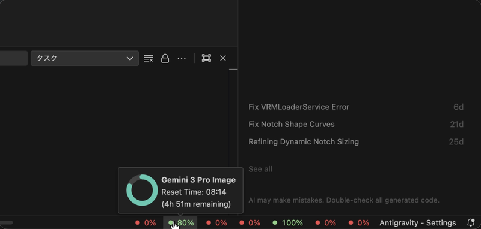
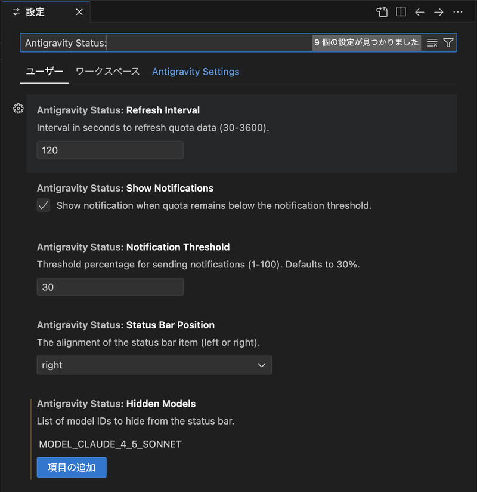
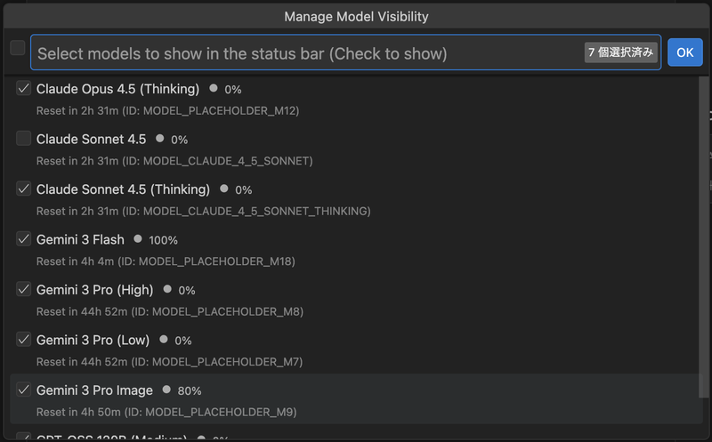

<div align="center">


# Antigravity Status

 Antigravity エディタの AI クォータ使用状況をステータスバーでリアルタイムに監視

[](https://opensource.org/licenses/MIT)
[](https://github.com/YoRuHub/antigravity-status)
[](https://github.com/yoruhub/antigravity-status)
[](https://nodejs.org/)
[](https://code.visualstudio.com/)
[](src/i18n/translations.ts)

[English](README.md) | 日本語

</div>

---

## 概要

**Antigravity Status** は、Antigravity エディタの AI クォータ（Gemini 3 Pro や Claude 等）の使用状況をステータスバーでリアルタイムに監視するためのプロフェッショナルな拡張機能です。
外部のダッシュボードを確認することなく、コーディング中に現在の残りクォータとリセット時間を確認できます。

---

## 主な機能

*   **リアルタイム監視**: ローカルの Antigravity プロセスに直接接続し、最新のクオリティ情報を取得。
*   **ステータスバー表示**: パーセンテージとカラーインジケーターで残量を一目で把握。
*   **詳細モニタリング**: クリックで全モデルの残量とリセット時間を一覧表示。
*   **スマート通知**: クォータが閾値を下回った際にデスクトップ通知でお知らせ。
*   **モデル管理**: 表示不要なモデルを個別に非表示設定可能。 [x]

<div align="center">
  
</div>

---

## 使用方法

### 1. 接続の確認
Antigravity エディタを起動すると、自動的にバックグラウンドプロセスを検出して接続を開始します。

### 2. クォータの確認
エディタ右下のステータスバーを確認してください。各モデルの残量がパーセンテージで表示されます。

### 3. 詳細情報の表示
ステータスバーの項目をクリックすると、QuickPick メメニューが開き、モデルごとのリセット時間やユーザーのアカウント情報を確認できます。

<div align="center">
  
</div>

### 4. 表示モデルのカスタマイズ
詳細メニューから「表示モデルの設定」を選択することで、ステータスバーに表示するモデルを自由に切り替えることができます。

<div align="center">
  
</div>

---

## インストール

### パッケージ版
.vsix ファイルを使用してインストールする場合：
```bash
antigravity --install-extension antigravity-status-0.0.1.vsix
```

### 開発版
ソースコードからビルドする場合：
```bash
git clone https://github.com/yoruhub/antigravity-status.git
cd antigravity-status
npm install
npm run compile
```

---

## 設定 (Configuration)

エディタの設定画面（`antigravityStatus`）から以下の項目をカスタマイズ可能です：

| 設定項目 | 説明 | デフォルト値 |
|:---|:---|:---|
| `refreshInterval` | データ更新の間隔（秒） | `120` |
| `notificationThreshold` | 通知を送信する残量の閾値（%） | `30` |
| `showNotifications` | 閾値超過時の通知の有効/無効 | `true` |
| `statusBarPosition` | ステータスバーの表示位置 (`left` / `right`) | `right` |
| `hiddenModels` | 非表示にするモデル ID のリスト | `[]` |

---

## 開発と貢献
バグ報告や機能要望は GitHub Issues にてお寄せください。プルリクエストも歓迎しています。 [x]

## ライセンス
[MIT License](LICENSE) &copy; 2026 yoru (YoRuHub)
